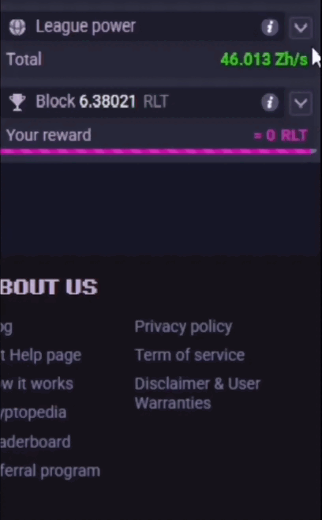

# 🎮 RollerCoin League Calculator

A simple calculator for the new **RollerCoin League system**.  
Check your mining earnings in **Coins, USD, and EUR**, with live prices from CoinGecko.  

---

## ✨ Features
- 🏆 **League system support** (Bronze → Diamond).  
- 💰 **Earnings table**: per block, daily, weekly, monthly.  
- 💱 **Currency modes**: Coins, USD, EUR.  
- ⏳ **Withdrawal estimate** based on minimum withdrawal amounts.  
- 📱 **Responsive**: works on desktop and mobile.  

---

## 🚀 Live Demo
👉 [Open the calculator](https://iamyahyr.github.io/rollercoin-league-calculator/)  

---

## 🕹️ How to use
1. **Enter your Mining Power** in the `Mining Power` field.  
   - Select the correct unit (GH/s, PH/s, EH/s, ZH/s).  
2. Wait for the automatic Minar y Ganar snapshot to load. It supplies the selected league's network power, rewards, and block duration.
3. If the live source is unavailable, go to RollerCoin → **League Power**, copy all the content, and paste it into the `Network Data` box.
    
4. Done ✅ The calculator will show your earnings in three tabs:  
   - **Coins**  
   - **USD**  
   - **EUR**  

Each mode displays:  
- Earnings **per block**, **daily**, **weekly**, **monthly**.  
- **Withdrawal time estimate** → how long it may take to reach the minimum withdrawal (⚠️ this can vary as the network changes).  

---

## 👨‍💻 Author
Made with ❤️ by [**iamyahyr**](https://rollercoin.com/p/iamyahyr)  

## Automatic Minar y Ganar data

The calculator now tries to read the public Minar y Ganar calculator API for current league rewards, network power, and real block durations. The manual network-data box remains available as a fallback, and the local JSON files are used if the API cannot be reached.

When deploying this standalone calculator from another domain, that domain must be added to Minar y Ganar's `PUBLIC_API_ALLOWED_ORIGINS` and CORS configuration for the live source to be readable by the browser.
